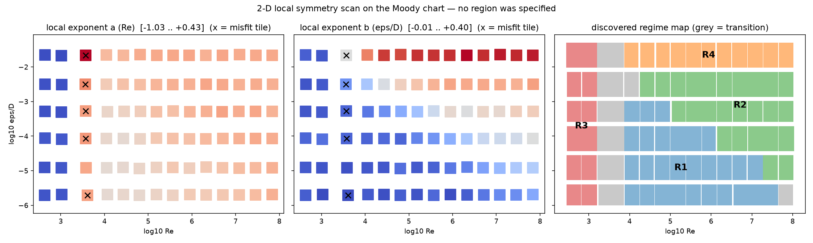
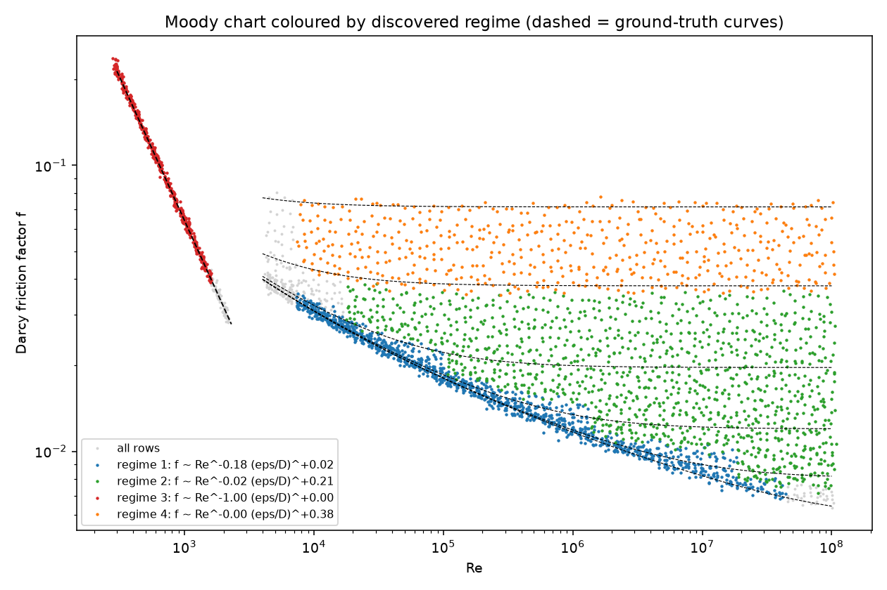

# Moody Chart — Region-Free 2-D Local Symmetry Discovery

This example pushes the Windowed Local Symmetry Scan (WLSS) of
[`../porous_media_lbm_symmetry/LOCAL_SYMMETRY.md`](../porous_media_lbm_symmetry/LOCAL_SYMMETRY.md)
past what the Ergun demo shows. Pipe friction has **three physical
regimes**, and one regime boundary — smooth-turbulent vs fully rough —
runs **diagonally** across the `(Re, ε/D)` plane, so no single-axis
interval scan can resolve it. `discover_local_symmetry_2d.py` extends
WLSS to a 2-D **regime map**: quantile *tiles* instead of quantile
intervals, and region growing instead of left-to-right merging. Nothing
about the regimes, their number, or their boundaries is given to the
scan.

---

## Ground truth (never shown to the pipeline)

The dataset is generated from the textbook Moody-chart physics for the
Darcy friction factor `f = 2·dP_L·D/(ρv²)`:

| Regime | Law | Local exponents `(a, b)` on `(Re, ε/D)` |
|---|---|---|
| **Laminar** (`Re < 2300`) | `f = 64/Re` (exact) | `(−1, 0)` |
| **Smooth turbulent** | Colebrook–White with `ε/D → 0`; Blasius power-law approximation `f = 0.316·Re^(−1/4)` for `4·10³ < Re < 10⁵`, effective exponent flattening toward ≈ −0.12 at `Re = 10⁸` (Prandtl law) | `(−0.25…−0.12, 0)` |
| **Fully rough** | von Kármán `f = [2·log₁₀(3.7·D/ε)]⁻²` | `(0, 2/ln(3.7·D/ε))` — `b ≈ 0.19…0.39` over this sweep |

Two structural features make this a stronger test than Ergun:

1. The turbulent regimes are **not exact monomials** — the Colebrook
   log-law has slowly varying local exponents. The scan must report
   honest *local* laws, and its merge tolerance decides how much slow
   drift counts as "one regime".
2. The smooth/rough boundary is the level set `Re·√(f/8)·ε/D ≈ 70`
   (roughness Reynolds number) — a **diagonal** in `(log Re, log ε/D)`.

The critical zone `2300 < Re < 4000` is excluded from sampling, exactly
as it is left blank on a Moody chart (intermittent flow, no steady
correlation).

## Dataset — `dataset_moody.csv`

`generate_moody_dataset.py` evaluates laminar + Colebrook–White over
`Re ∈ [3·10², 10⁸]` (95 grid values, critical zone removed) ×
`ε/D ∈ [10⁻⁶, 5·10⁻²]` (40 values), with 3 % log-normal noise on `f`
and 3 % jitter on `Re`: **3800 rows** (640 laminar), each carrying the
physically consistent raw inputs `(dP_L, v, mu, rho, D, eps)`.
`f_true` and `branch` are reference-only columns.

## Method — WLSS-2D

Same statistical machinery as the 1-D scan, lifted to two dimensions:

- **Tile** the data into a 14×6 quantile grid in `(ln Re, ln ε/D)`.
- **Fit** per tile the local plane `ln f = ln C + a·ln Re + b·ln(ε/D)`
  — `(a, b)` is the local scaling-symmetry direction.
- **Bands**: pairs bootstrap per tile (300×) → 95 % bands + covariance.
- **Validity**: data-driven noise floor (10th percentile of tile RMS);
  tiles above 3× the floor are transition tiles, never fitted.
- **Region growing**: seeds in order of residual RMS; a 4-neighbour
  tile joins a region iff it matches the region's *pooled* fit (χ² on
  bootstrap covariances OR all exponent shifts < `--merge-tol` = 0.10).
  Anchoring to the pooled fit stops slow exponent drift from chaining
  two different regimes together. Regions with ≥ 3 tiles are regimes.

## Committed result (`output_moody/`, defaults, seed 0)

| Discovered | Tiles/rows | Local law | Reference | Deviation |
|---|---|---|---|---|
| **R3 — laminar** | 12 / 543 | `f = 65.7·Re^(−1.003)·(ε/D)^(+0.000)` | `64·Re⁻¹`, `(−1, 0)` | **0.003** |
| **R1 — smooth turbulent** | 28 / 1241 | `f = 0.173·Re^(−0.176)·(ε/D)^(+0.016)` | Blasius `(−0.25, 0)`, exponent flattening with Re | 0.076 |
| **R2 — fully rough (moderate ε/D)** | 25 / 1133 | `f = 0.114·Re^(−0.017)·(ε/D)^(+0.209)` | von Kármán `(0, 0.227)` at `ε̄/D = 5.5·10⁻⁴` | **0.025** |
| **R4 — fully rough (high ε/D)** | 11 / 522 | `f = 0.235·Re^(−0.004)·(ε/D)^(+0.381)` | von Kármán `(0, 0.390)` at `ε̄/D = 2.2·10⁻²` | **0.010** |
| transition | 8 tiles | none claimed | critical zone + smooth/rough diagonal | — |

All exponent 95 % bands are ±0.006 or tighter; every reference value
sits within ~2 tolerance units of its regime. The scan colours the
Moody chart exactly as the textbook draws it:





**Why two rough regimes?** The von Kármán law is logarithmic, not a
power law — its local `ε/D` exponent `2/ln(3.7·D/ε)` genuinely varies
from 0.19 to 0.39 across the sweep. The scan honestly splits it into
patches that are constant-exponent *within the merge tolerance*, and
each patch matches the log-law's local slope at its own mean roughness
(deviations 0.010–0.025). The same applies to the smooth-turbulent
patch, whose pooled `a = −0.176` averages the known Blasius→Prandtl
flattening (per-tile deviation up to 0.107 is reported alongside).

**The merge tolerance is an exponent-resolution dial.** Tightening
`--merge-tol` from 0.10 to 0.07 (or refining the grid to 16×7) resolves
*more* true structure, not noise: a pure Blasius patch appears
(`a = −0.24…−0.26, b ≈ 0.001`) and the rough side splits into three
patches whose `b` = 0.18, 0.28, 0.38 track `2/ln(3.7·D/ε)` as roughness
grows.

**Robustness:** seeds 0/3 and grids 12×5 / 14×6 / 16×7 all reproduce
the same laminar + smooth + rough structure with matching exponents
(the finer grid adds the resolved Blasius patch, as above).

## How to run

```bash
cd projects/20260912_Stage1_Prokash/Examples/moody_chart_symmetry

python generate_moody_dataset.py         # only needed once
python discover_local_symmetry_2d.py --data dataset_moody.csv \
    --output-dir output_moody --compare-moody
```

Outputs: `local_symmetry_2d_report.txt` (full report),
`local_symmetry_2d_scan.json`, `moody_regime_map.png` (per-tile
exponent heat maps + discovered regime map), `moody_chart_discovered.png`,
and `regime_k_rows.csv` per regime for the existing Stage-1 tools.
Knobs: `--nx/--ny` (tile grid; each expected regime needs ≥ 3 tiles
with ≳ 40 rows each), `--merge-tol` (exponent resolution, default
0.10), `--bootstrap`, `--seed`. Drop `--compare-moody` on
non-synthetic data.

## Files

```
moody_chart_symmetry/
├── README.md                      ← this file
├── generate_moody_dataset.py      ← laminar + Colebrook-White generator
├── dataset_moody.csv              ← 3800 rows, full Moody chart
├── discover_local_symmetry_2d.py  ← WLSS-2D: tiles + region growing
└── output_moody/                  ← committed run (report, JSON, figures,
                                     per-regime CSVs)
```

Dependencies: `numpy`, `pandas`, `matplotlib` (no torch needed — the
local estimator is closed-form OLS).
