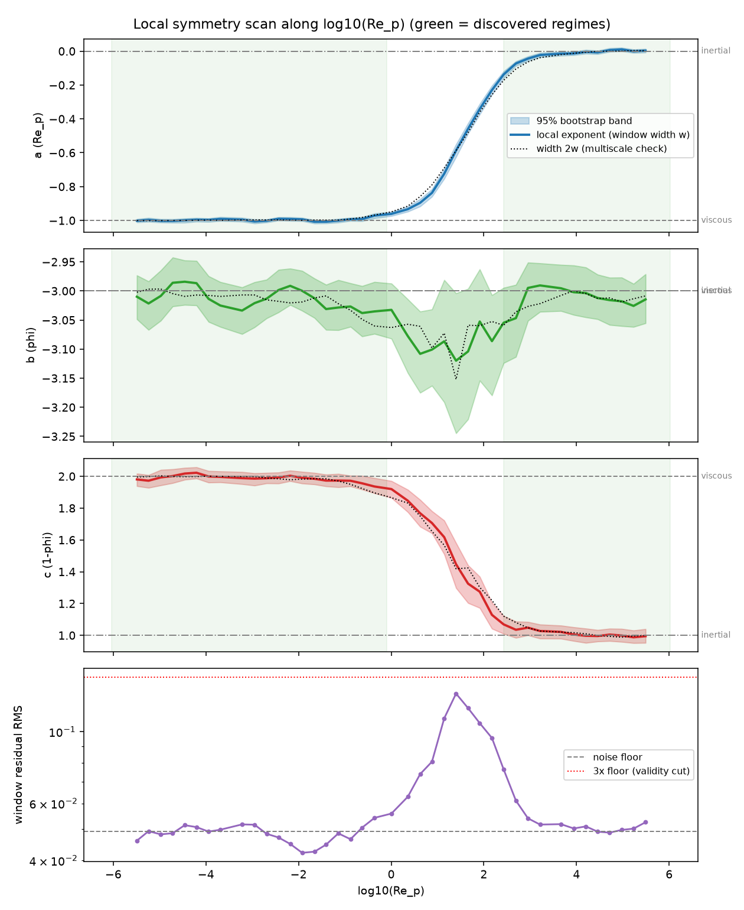
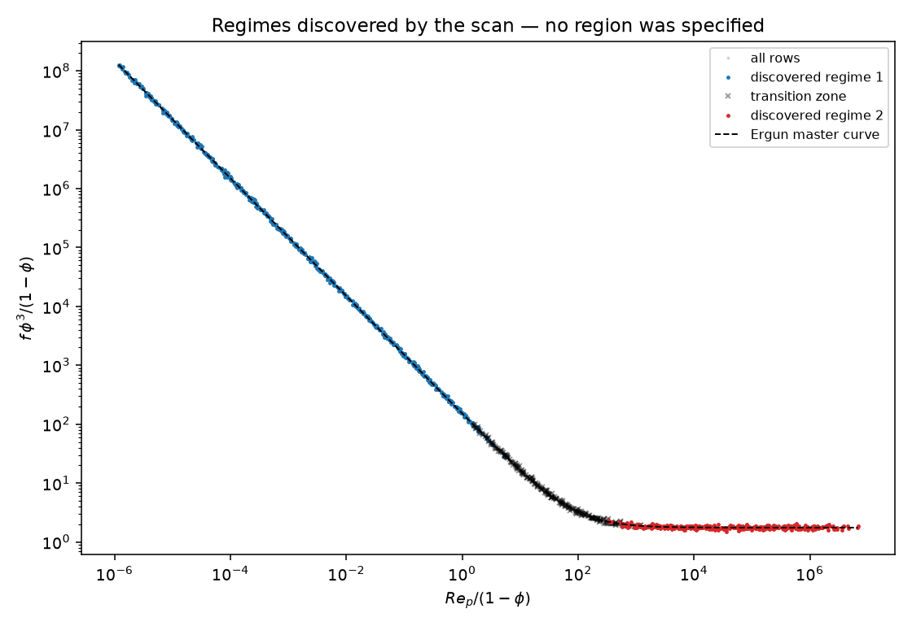

# Region-Free Local Symmetry Discovery with Uncertainty Bands (WLSS)

**Question this answers:** *can we discover the local symmetries of a
dataset that spans several physical regimes — like the full Ergun curve —
without telling the pipeline where the regimes are?*

The two-region workflow in this example (`README.md`) requires the user
to hand the pipeline a regime-pure dataset: the "region" is baked in at
data-generation time (`dataset_ergun_viscous_widephi.csv` vs
`dataset_ergun_inertial_widephi.csv`). The **Windowed Local Symmetry
Scan (WLSS)** implemented in `discover_local_symmetry.py` removes that
requirement: it takes ONE dataset spanning the whole curve and returns
the regimes, their local scaling laws, uncertainty bands on every
exponent, and the transition zone — all data-driven.

---

## The idea

Stage-1 established that within each pure regime the target obeys a
single monomial (`k* = 1`, scaling symmetry):

```
f = C · Re_p^a · φ^b · (1−φ)^c
```

In log-Pi coordinates `x = [ln Re_p, ln φ, ln(1−φ)]` a monomial is a
*plane*: `ln f = ln C + g·x`. The exponent vector `g = (a, b, c)` **is**
the local scaling-symmetry direction — its 2-D null space spans the
local symmetry generators. So the local symmetry at any point of the
Pi-manifold is estimable by *local linear regression in log space*, and
"discovering local symmetries without specifying regions" becomes a
well-posed statistical problem: **estimate the exponent field g(x),
quantify its uncertainty, and segment it into statistically constant
pieces.**

Concretely:

| Step | What happens |
|---|---|
| **1. Scan** | Slide overlapping quantile windows along *every* log-Pi coordinate in turn. No axis is privileged a priori — the data decide (below) which axis carries regime structure. |
| **2. Fit** | Per window, OLS of `ln f` on `[ln Re_p, ln φ, ln(1−φ)]` → local exponents `g_w` and prefactor `C_w`. |
| **3. Uncertainty band** | Pairs bootstrap (resample rows *within* the window, refit, 400×) → percentile 95 % bands on each exponent + the full bootstrap covariance of the direction. This is the uncertainty band you asked for: it is nonparametric, honest about ill-conditioning (bands blow up where the design can't identify a component), and needs no noise model. |
| **4. Validity cut** | A window supports a local power law only if its residual RMS sits at the dataset **noise floor** (estimated data-driven as the 10th percentile of all window RMS values over all axes). Windows far above the floor straddle regime structure at this width and are never counted as regimes. |
| **5. Segmentation** | Along each axis, merge consecutive non-overlapping windows whose exponents are **statistically indistinguishable** (χ² test on bootstrap covariances) **or practically equivalent** (all shifts `< --merge-tol`, default 0.10 — a region-of-practical-equivalence rule: with very low noise the bands become so tight that physically negligible drift is statistically detectable). Maximal merged runs = discovered regimes; the rest = transition zones. |
| **6. Bridging** | A single noisy window can falsely split one physical regime. If two regime segments are separated only by windows that individually pass the validity cut, and their pooled exponents are equivalent, they are re-merged. |
| **7. Multiscale check** | The whole scan is repeated at twice the window width; per window center the script reports whether the coarse estimate falls inside the fine bands. Regimes are trusted where the scales agree. |

### Identifiability (the φ / 1−φ wall)

`φ` and `1−φ` never vary independently — the data live on the manifold
`Π₄ = 1 − Π₃` — so only the manifold-projected 2-D exponents
`(a, b_eff)` with `b_eff = b − φ̄/(1−φ̄)·c` are identifiable per window
(same projection as in `README.md`). All segmentation *tests* therefore
run in that projected space; the raw 3-D exponents are still reported,
with bands that widen honestly wherever the local design is
ill-conditioned.

### Which scan axis is "the" regime coordinate?

The scan does not need to be told. A scan axis is **resolving** when its
windows reach the noise floor (a narrow window along that axis isolates
a single local power law). On the full Ergun data:

- along `log10(Re_p)`: **41/41 windows resolving** → regime structure
  lives here;
- along `log10(φ)` or `log10(1−φ)`: **0/41 resolving** — a
  narrow-φ window still spans the whole Re range and mixes both regimes,
  so no single power law fits. The scan reports these axes as
  non-resolving instead of returning garbage exponents.

---

## Result on the full Ergun curve (committed run)

Input: `dataset_ergun_full_curve.csv` — 1152 rows from the *full*
Ergun formula, `Re_p ∈ [10⁻⁶, 10⁺⁶]` (12 decades straddling the
crossover at `Re_c = 85.7·(1−φ) ≈ 13…73`), `φ ∈ [0.15, 0.85]`, 5 %
log-normal noise. **No regime labels of any kind.**

`python discover_local_symmetry.py --data dataset_ergun_full_curve.csv
--output-dir output_local_symmetry --compare-ergun` discovers, with
window width = 10 % of the data and 400 bootstrap resamples:

| | Discovered span (log₁₀ Re_p) | Discovered local law | 95 % bands | Truth |
|---|---|---|---|---|
| **Regime 1** | −6.0 … −0.1 | `f = 148.6 · Re_p^−0.999 · φ^−3.012 · (1−φ)^+1.988` | a [−1.000,−0.998], b [−3.032,−2.999], c [+1.969,+2.003] | `150 · Re⁻¹ φ⁻³ (1−φ)²` — manifold cos **+1.0000** |
| **Transition** | +0.1 … +2.4 | none claimed (exponents drift; residual RMS peaks) | — | crossover `Re_c ≈ 13…73` → log₁₀ ∈ [1.1, 1.9] ✓ inside |
| **Regime 2** | +2.4 … +6.0 | `f = 1.942 · Re_p^−0.008 · φ^−3.009 · (1−φ)^+1.011` | a [−0.011,−0.006], b [−3.039,−2.979], c [+0.981,+1.041] | `1.75 · φ⁻³ (1−φ)¹` — manifold cos **+1.0000** |





Robustness (all reproduce the same two regimes + transition): seeds 0
and 7 identical; window widths 0.08 and 0.10 agree after bridging.
Width 0.15 under-resolves the inertial side — with 2-decade windows only
two windows fit in the plateau and one touches the crossover. That is
the expected resolution limit: **choose the window width so an expected
regime holds ≥ 2–3 non-overlapping windows**, and trust regimes where
the built-in 2×-width multiscale check agrees (dotted line inside the
bands in the scan figure).

---

## Why this is robust and valid

| Threat | Mitigation |
|---|---|
| Noise in `f` | Nonparametric pairs bootstrap per window → percentile bands; no Gaussian or variance-model assumption. |
| φ/(1−φ) collinearity | Tests run on manifold-projected identifiable exponents; raw 3-D bands widen honestly when ill-conditioned (conditioning number reported per window). |
| Over-segmentation (bands so tight that negligible drift is "significant") | ROPE merge tolerance (`--merge-tol`, default 0.10 ≪ the true between-regime separation ≈ 1.0). |
| False regime splits from one noisy window | Bridging post-pass (step 6). |
| Claiming a power law where none holds (crossover) | Data-driven noise floor + 3× validity cut on window residual RMS; the crossover is *reported as a transition zone*, not fitted. |
| Window-width bias | Multiscale (w vs 2w) agreement check reported per center. |
| Wrong scan coordinate | All Pi axes scanned; non-resolving axes are flagged instead of fitted. |
| Optimizer/seed sensitivity (NN pipelines) | The local estimator is closed-form OLS — deterministic given the window; no restarts, no basins. |

The estimator itself is classical local polynomial regression
(degree 1 in log space), so standard theory applies: where the local law
is exactly a monomial the OLS gradient is unbiased, and the bootstrap
percentile interval is a consistent confidence band. Where the law is
not a monomial, the misfit cut and the exponent drift make that visible
instead of hiding it.

## Division of labour with the existing Stage-1 pipeline

WLSS does **not** replace Stage 1 — it *finds the regions* so Stage 1
doesn't have to be told. The scan writes each discovered regime back out
in the standard dataset schema (`output_local_symmetry/regime_k_rows.csv`),
ready for the existing tools to certify per regime that `k* = 1` and
that the scaling encoder beats translation/rotation:

```bash
python discover_symmetry.py            --data output_local_symmetry/regime_1_rows.csv --output-dir output_regime1
python discover_equation_encoder_l2.py --data output_local_symmetry/regime_1_rows.csv --out output_regime1 --region viscous --split-seed 42
```

The scan's OLS law and the encoder-L2 law should agree within the
bands — a cross-method consistency check that costs one command.

## How to run

```bash
cd projects/20260912_Stage1_Prokash/Examples/porous_media_lbm_symmetry

# one dataset spanning viscous + crossover + inertial (only needed once)
python generate_full_ergun_dataset.py

# the region-free scan (drop --compare-ergun on non-synthetic data)
python discover_local_symmetry.py --data dataset_ergun_full_curve.csv \
    --output-dir output_local_symmetry --compare-ergun
```

Outputs in `output_local_symmetry/`:

| File | Contents |
|---|---|
| `local_symmetry_report.txt` | Full report: per-axis resolving fraction, regimes with exponents + 95 % bands + laws, transition zones, multiscale agreement |
| `local_symmetry_scan.json` | Machine-readable version of everything |
| `local_symmetry_scan_{Rep,phi,1mphi}.png` | Exponent trajectories with bootstrap bands, 2×-width check, discovered regimes shaded, residual-RMS diagnostic |
| `local_symmetry_regimes.png` | Ergun collapse coloured by discovered regime — visual proof no region was specified |
| `regime_k_rows.csv` | Per-regime datasets for the existing Stage-1 tools |

Knobs: `--window-frac` (default 0.10; the resolution/variance
trade-off), `--merge-tol` (default 0.10; practical-equivalence scale for
exponents), `--bootstrap` (default 400), `--seed`, `--n-centers`
(trajectory resolution only).

## Limitations and natural extensions

- **Regime boundaries aligned with one Pi coordinate.** The scan
  segments along single axes, which is exact here (the crossover is a
  level set of `Re_p/(1−φ)`, nearly a level set of `Re_p` over this φ
  range — the residual φ-dependence of `Re_c` is absorbed into the
  transition zone). For regime boundaries that cut diagonally across
  Pi space, the same window machinery applies but segmentation should
  cluster the per-point direction field (e.g. spherical k-means on
  bootstrap-whitened exponent vectors), or the scan coordinate can be
  *learned* — e.g. scan along the 1-D latent of a globally trained
  Stage-2 encoder instead of a raw Pi axis.
- **Local `k* = 1` is assumed** (one monomial per window). Windows where
  more than one latent direction matters fail the misfit cut rather than
  giving wrong answers; a per-window latent-dimension sweep (Stage 2 in
  miniature) is the natural upgrade.
- **Coverage of bootstrap bands** is asymptotic; with very few rows per
  window (< ~50) prefer wider windows or BCa intervals.
- The synthetic full-curve dataset uses the LBM-matched noise model
  (5 % log-normal); on real LBM/experimental data the noise floor is
  estimated the same data-driven way, so no changes are needed.
