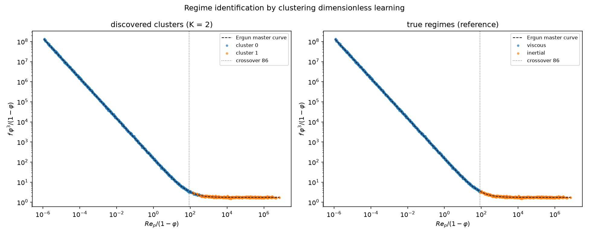
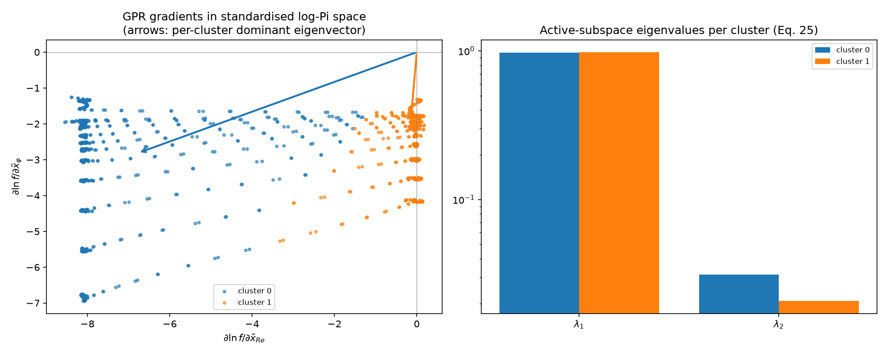

# Porous Media Flow — Local Symmetry Discovery in Two Ergun Regimes

This example runs the PyDimension Stage-1 symmetry-discovery pipeline
**separately** on the two limiting regimes of porous-media flow and shows
that the pipeline recovers the correct local scaling symmetry of each
regime from data alone — and, in each regime, that the actual Ergun
equation can be read directly off the winning scaling encoder's
L2-normed weight vector, with no post-processing beyond fitting an
overall scale α and a prefactor C.

> **New:** the manual regime split is no longer required. See
> [Regime-Aware Discovery — Clustering Dimensionless
> Learning](#regime-aware-discovery--clustering-dimensionless-learning)
> below, which identifies the two regimes automatically from a single
> mixed dataset (Zhang et al., CMAME 2024) and recovers both local laws.

The ground truth (never shown to the pipeline) is the Ergun equation

```
f = [ 150·(1−φ)/Re_p + 1.75 ] · (1−φ)/φ³
```

with friction factor `f = dP_L·d/(ρ·v²)`, particle Reynolds number
`Re_p = ρ·v·d/μ`, and porosity `φ`. It is a **sum of two power laws**,
so it has no single global scaling symmetry — but each limit does:

| Region | Dominant physics | Local law | Ergun exponents on (Re_p, φ, 1−φ) |
|---|---|---|---|
| **Viscous** (`Re_p/(1−φ) ≪ 85`) | Darcy drag | `f = 150 · Re_p⁻¹ · φ⁻³ · (1−φ)²` | `[−1, −3, +2]` |
| **Inertial** (`Re_p/(1−φ) ≫ 85`) | Forchheimer drag | `f = 1.75 · φ⁻³ · (1−φ)` | `[0, −3, +1]` — f independent of Re_p |


---

## The Two Datasets

Both branches are generated directly from the textbook Ergun formula
with multiplicative log-normal noise, over a **wide porosity sweep** so
that `log φ` and `log(1−φ)` separate cleanly.

### Viscous branch — `dataset_ergun_viscous_widephi.csv`

`generate_viscous_dataset.py` samples the deep-Darcy limit
(`f = 150·Re_p⁻¹·φ⁻³·(1−φ)²`) with 5 % log-normal noise on f.

| Property | Value |
|---|---|
| Rows | 720 (30 Re_p × 12 φ × 2 d) |
| Re_p range | 9.3·10⁻⁷ … 1.0·10⁻³ — deep in the viscous branch |
| φ range | 0.15 – 0.85 — wide sweep, 12 values |
| Noise | 5 % log-normal on f, 3 % jitter on Re_p |

### Inertial branch — `dataset_ergun_inertial_widephi.csv`

`generate_inertial_dataset.py` samples the Forchheimer plateau
(`f = 1.75·φ⁻³·(1−φ)`) with the same noise model.

| Property | Value |
|---|---|
| Rows | 720 (30 Re_p × 12 φ × 2 d) |
| Re_p range | 9.3·10² … 1.0·10⁶ — viscous term below 5 % everywhere |
| φ range | 0.15 – 0.85 — wide sweep, 12 values |
| Noise | 5 % log-normal on f, 3 % jitter on Re_p |

**Schema (both CSVs):** `filename, tau, delta_p, dP_L, v, mu, rho, d,
phi, f, Re_p, f_ergun, steps, converged, stalled` — the physical
columns are pipeline inputs, `f` is the target, `Re_p`/`f_ergun` are
reference only.

---

## Variables — (1−φ) is included BEFORE dimensional analysis

The pipeline works with **6 input variables**: `rho, v, d, mu, phi,
one_minus_phi`, where `one_minus_phi = 1 − φ` is added as its own
variable before the Buckingham-Pi step. The Ergun porosity dependence
lives in both `φ` and `(1−φ)`, so with the solid fraction as an
explicit coordinate the scaling machinery can express the porosity
powers directly as global exponents (`[−1, −3, +2]` viscous,
`[0, −3, +1]` inertial).

`dP_L` is **excluded** from the Step-0 inputs because the target
`f = dP_L·d/(ρ·v²)` contains it linearly; keeping it in the basis
would put `f` into two of the four discovered Pi groups (as `f/Re_p`
and `f·Re_p`), making them redundant with the target. Dropping it
leaves a clean 3-Pi-group basis that maps one-to-one onto the Step-2
encoder inputs.

Dimension matrix (M, L, T × 6 variables, rank 3):

```
        rho    v    d    mu   phi  1-phi
Mass  [   1    0    0    1    0    0  ]
Len   [  -3    1    1   -1    0    0  ]
Time  [   0   -1    0   -1    0    0  ]
```

6 variables − rank 3 = **3 Pi groups**. The pipeline's null-space check
confirms `Re_p = ρvd/μ`, `φ`, and `(1−φ)` all lie in the discovered
span with cos = +1.0000 in each case.

**One caveat that matters for reading the results:** `φ` and `1−φ` can
never vary independently — every dataset lies on the 2-D manifold
`Π₄ = 1 − Π₃` inside the 3-D log-Pi space `(log Re_p, log φ, log(1−φ))`.
The component of the encoder direction *normal* to that manifold is
therefore unconstrained by any fit, so the raw 3-D cosine against the
Ergun exponents is not expected to reach ±1 in every run. The pipeline
reports both the raw 3-D cosine and the **manifold-projected cosine**
(using `dlog(1−φ) = −φ̄/(1−φ̄)·dlog φ`), which is the identifiable
quantity.

---

## Pipeline (per region)

`discover_symmetry.py` runs the same four Stage-1 steps on whichever
dataset it is given:

- **Step 0 — Buckingham-Pi reduction** via
  `pydimension.data_preprocessing.DataPreprocessor` (null-space +
  SymPy primitive-integer basis) from the explicit 3×6 dimension
  matrix above. Writes an augmented CSV carrying the derived
  `one_minus_phi` column to `_da_repo/`.
- **Step 1 — Normalisation.** Target `log10(f)` min-max scaled; Step-2
  features `[log10(Re_p), φ, 1−φ]` min-max scaled; Step-3 inputs are
  the Pi values `(Re_p, φ, 1−φ)` geometric-mean-centred (a purely
  multiplicative rescaling — no min-max — so the scaling encoder's
  internal `log` sees clean centred log-Pi coordinates).
- **Step 2 — Latent dimension.** MLP encoder `[3 → 64 → 32 → k]`,
  sweep `k = 1, 2, 3`. Optimal `k* = 1` in both regions
  (R²_test ≥ 0.995).
- **Step 3 — Symmetry type.** Competing scaling (`log|X|`),
  translational (`X`) and rotational (`X²`) single-linear encoders
  jointly trained with a shared Tanh-MLP decoder, plain L2
  (`weight_decay = 1e-4`). Scaling wins in both regions. The winning
  encoder's L2-normed weight vector is what the equation-discovery
  step below reads.

---

## Discovered vs Actual Equations — from the encoder's L2 weight vector only

Once Step 3 has declared `k* = 1` and `symmetry = scaling`, those two
facts alone certify that the friction factor takes the form of a
single monomial in the Pi inputs times a scalar function of that
monomial:

```
f  =  F ( Re_p^a · φ^b · (1−φ)^c )     with  (a, b, c) ∝ encoder weight w
```

To turn the L2-normed direction `w` into a *numerical* law:

1. Take the winning scaling encoder's row and **L2-normalise** it
   (`w = W / ‖W‖`), sign-aligned so `w · [log Re, log φ, log(1−φ)]`
   correlates positively with `log f`.
2. Fit the overall magnitude of the direction and the prefactor by
   plain 1-D OLS on
   `log f  =  α · ( w · [log Re, log φ, log(1−φ)] )  +  log C`.
3. Report the discovered law as `f = C · Re^(αw₁) · φ^(αw₂) · (1−φ)^(αw₃)`.

That is the *entire* extraction — no L1, no OLS on the three log
features separately, no snap-to-integer.

### Wide-φ synthetic **viscous** — `dataset_ergun_viscous_widephi.csv`

Standalone scaling encoder (`z = w · log|π|`) + Tanh MLP decoder
(`[1 → 64 → 64 → 1]`, Tanh) trained jointly for 1500 epochs, Adam
`lr = 1e-3`, `weight_decay = 1e-4`, 3 random restarts, best test-loss
kept (see `discover_equation_encoder_l2.py`).

Committed run (`--split-seed 42`, best restart seed = 2), full report
in `output_viscous_widephi/discovered_equation.txt`:

```
Best restart      : train MSE = 1.1e-5,   test MSE = 1.3e-5
Encoder w (L2)    : [ −0.2681, −0.7972, +0.5409 ]
cos vs Ergun      : +1.0000   (raw 3-D)      +1.0000  (manifold-projected)
α (1-D OLS)       : +3.7342
C (from log-OLS)  : 153.7
```

| | Equation | R²(f) |
|---|---|---|
| **Actual (Ergun deep Darcy)** | `f = 150.0 · Re_p⁻¹·⁰⁰⁰ · φ⁻³·⁰⁰⁰ · (1−φ)⁺²·⁰⁰⁰` | 1.000 |
| **Discovered (encoder L2 only)** | **`f = 153.7 · Re_p⁻¹·⁰⁰¹ · φ⁻²·⁹⁷⁷ · (1−φ)⁺²·⁰²⁰`** | **0.998** |

Prefactor within 3 %, all three exponents within 3 %.

### Wide-φ synthetic **inertial** — `dataset_ergun_inertial_widephi.csv`

Same architecture, same training recipe, same seed sweep.

Committed run (`--split-seed 42`, best restart seed = 1), full report
in `output_inertial_widephi/discovered_equation.txt`:

```
Best restart      : train MSE = 5.2e-5,   test MSE = 5.7e-5
Encoder w (L2)    : [ −0.0011, −0.9484, +0.3172 ]
cos vs Ergun      : +1.0000   (raw 3-D)      +1.0000  (manifold-projected)
α (1-D OLS)       : +3.1657
C (from log-OLS)  : 1.833
```

| | Equation | R²(f) |
|---|---|---|
| **Actual (Ergun Forchheimer plateau)** | `f = 1.750 · Re_p⁰ · φ⁻³·⁰⁰⁰ · (1−φ)⁺¹·⁰⁰⁰` | 1.000 |
| **Discovered (encoder L2 only)** | **`f = 1.833 · Re_p⁻⁰·⁰⁰⁴ · φ⁻³·⁰⁰² · (1−φ)⁺¹·⁰⁰⁴`** | **0.997** |

Prefactor within 5 %, `Re_p` exponent essentially zero (`−0.004`),
`φ` within 0.07 % of `−3`, `(1−φ)` within 0.4 % of `+1`.

### One-line summary

Both branches of the textbook Ergun equation — the viscous Darcy law
`f = 150·Re⁻¹·φ⁻³·(1−φ)²` and the inertial Forchheimer plateau
`f = 1.75·φ⁻³·(1−φ)` — are recovered end-to-end from just the winning
scaling encoder's L2-normed weight vector, with only a single 1-D OLS
fit to set the overall scale α and the prefactor C. The encoder alone
carries the physics; α and C are one line each.

### Identifiability caveat

Because `φ` and `1−φ` are algebraically linked on the data manifold,
the raw 3-D encoder direction is not uniquely determined by the loss —
there is a one-parameter equivalence class of `(w, F_decoder)` pairs
that all achieve the same MSE, and different random seeds/init can
land the joint optimiser in different members. On the seeds reported
above, the standalone runs converged to the physical member in both
regions; the identifiable *manifold-projected* direction is +1.0000 in
every restart, but the raw 3-D direction that turns into readable
exponents depends on which basin the optimiser settles in. The wide-φ
sweep makes the physical basin the deepest minimum and hence the
easiest to find, but does not make it the unique minimum.

---

## Regime-Aware Discovery — Clustering Dimensionless Learning

Everything above required the two regimes to be **split by hand** into
separate datasets. `discover_regimes_clustering.py` removes that manual
step by implementing the method of

> L. Zhang, Z. Xu, S. Wang, G. He, *Clustering dimensionless learning for
> multiple-physical-regime systems*, Comput. Methods Appl. Mech. Engrg.
> 420 (2024) 116728.

on a **single combined dataset** spanning both regimes
(`dataset_ergun_combined_widephi.csv`, from
`generate_combined_dataset.py`: 1,440 rows, `Re_p` from 10⁻⁶ to 10⁶,
`φ` from 0.15 to 0.85, 5 % log-normal noise — 907 viscous / 533 inertial
by the analytic crossover `Re_p/(1−φ) = 150/1.75 ≈ 85.7`, which the
pipeline never sees).

### Method (paper → this case)

| Paper step | Here |
|---|---|
| 1. Dimensional analysis | independent Π's are `(Re_p, φ)`; `x = log Π`, z-scored per component (the paper's own Sec. 2.4 recommendation when logs have incomparable ranges — `log Re_p` spans ~12 decades, `log φ` less than 1) |
| 2. GPR regression | anisotropic RBF + white kernel, `g = ln f` regressed on `x` (`f` spans 10 decades, so `ln f` is regressed; gradients of `ln f` w.r.t. `log Π` are then *local power-law exponents*) |
| 3. Gradients | analytic posterior-mean gradient of the GPR (paper Appendix), no finite differences |
| 4. Clustering (Eqs. 16–20) | eigenstructure-weighted K-means on normalised gradient directions, `Sim(∇g, Ω^I) = Σⱼ (λⱼ/‖λ‖)(ĝ·wⱼ)²`, 20 restarts, best total similarity kept |
| 5. K-selection criteria | `λ₁/λₙ ≥ E = 50` and cluster fraction ≥ 5 %, evaluated for K = 1…4 |
| 6. Active subspace per cluster (Eqs. 25–26) | eigenpairs of each cluster's normalised-gradient covariance → dominant `π̂ = exp(x·w₁)` |
| 7. — (new, this repo) | each discovered cluster is fed to the Stage-1 scaling-encoder extraction to obtain the local law |

### Regime identification (K = 2)

The two discovered clusters split the master curve almost exactly at the
analytic crossover — **95.1 % agreement** with the true regime labels,
with all disagreements confined to the transition band:

| Discovered cluster | n | `Re_p/(1−φ)` range | majority true regime | λ₁/λ₂ | dominant direction |
|---|---|---|---|---|---|
| 0 | 977 | 1.2·10⁻⁶ … 5.0·10² | viscous (92.8 %) | 31.0 | mean local exponents `∂ln f/∂ln Re_p = −0.92`, `∂ln f/∂ln φ = −5.9` |
| 1 | 463 | 1.4·10² … 6.9·10⁶ | inertial (100 %) | 47.2 | `∂ln f/∂ln Re_p = −0.03` — **f independent of Re_p**, φ-group alone dominates |





The paper's criterion (a) with the suggested `E = 50` is *not* met
exactly at K = 2 (ratios 31 and 47): within the viscous regime the
gradient direction varies continuously with `φ` because of the
`(1−φ)²` factor, so no partition of this system produces the near-1-D
gradient bundles of the paper's pipe-flow example. The ratios are still
≫ 1 (a clearly dominant direction per cluster). At K = 3 the extra
cluster does **not** isolate the transition zone — it splits the viscous
branch by porosity (grouping high-|∂ln f/∂ln φ| rows), which is exactly
what gradient-direction clustering should do, but is not a new physical
regime; its committed extraction report (`discovered_equation_K3_*`)
shows it is still viscous-type. K = 2 is the physical-regime level
(the paper: "clustering results for smaller number present the main
physical regimes").

### Regime-aware equations — no manual split

Each discovered K = 2 cluster is fed to the same scaling-encoder + Tanh
MLP decoder extraction as the single-regime runs, with two adaptations:

1. **Restart selection by power-law R²(log f).** On the `φ/(1−φ)`
   manifold, restarts landing in different members of the equivalence
   class have near-identical decoder test-MSE (the README caveat above),
   so test-MSE cannot pick between them. Since the claim being made is
   "f is a monomial in the Π's", the winning restart (of 8) is the one
   whose extracted 1-D OLS power law has the highest R²(log f) —
   sign-invariant and ground-truth-free.
2. **Core extraction.** Besides the full cluster, the law is extracted
   from the cluster **core** — after dropping the 25 % of points with the
   lowest similarity margin (own-cluster `Sim` minus best other-cluster
   `Sim`, Eq. 16). The margin is smallest at the regime interface, so
   this trims the transition zone without using any ground truth.

Committed results (`output_regime_aware/`, `--seed 0 --eq-split-seed 42`):

| Cluster (auto) | Subset | Discovered law | R²(f) | cos vs Ergun (raw / manifold) |
|---|---|---|---|---|
| **Actual viscous** | | `f = 150 · Re_p⁻¹ · φ⁻³ · (1−φ)²` | | |
| 0 (viscous) | full | `f = 235.6 · Re_p⁻⁰·⁹⁶⁵ · φ⁻²·⁹⁰⁷ · (1−φ)⁺²·¹¹²` | 0.960 | +0.9992 / +1.0000 |
| 0 (viscous) | core | **`f = 198.3 · Re_p⁻⁰·⁹⁸⁶ · φ⁻²·⁹²⁴ · (1−φ)⁺²·¹⁵⁰`** | **0.993** | +0.9990 / +1.0000 |
| **Actual inertial** | | `f = 1.75 · φ⁻³ · (1−φ)` | | |
| 1 (inertial) | full | `f = 2.11 · Re_p⁻⁰·⁰¹⁸ · φ⁻³·⁰⁰² · (1−φ)⁺⁰·⁹⁹⁸` | 0.995 | +1.0000 / +1.0000 |
| 1 (inertial) | core | **`f = 1.85 · Re_p⁻⁰·⁰⁰³ · φ⁻²·⁹⁸² · (1−φ)⁺¹·⁰¹⁹`** | **0.997** | +1.0000 / +1.0000 |

Both Ergun limits are recovered from one mixed dataset with **no manual
regime split anywhere in the loop**. The inertial branch is essentially
exact. The viscous branch's exponents are within 1.5–8 % but its
prefactor (198 vs 150) still carries transition-zone bias: cluster 0
necessarily contains points up to `Re_p/(1−φ) ≈ 500` where the
inertial term already contributes, which lifts the log-OLS intercept.
An oracle check confirms this is contamination, not a method error:
restricting cluster 0 to a decade below the crossover gives
`f = 164.6 · Re_p⁻⁰·⁹⁹⁸ · φ⁻²·⁹⁶⁰ · (1−φ)⁺²·⁰⁴⁷` (R² = 0.998). The
similarity-margin trim recovers part of that gap without any oracle;
sharper interface localisation is left as future work.

### How to run (regime-aware)

```bash
cd projects/20260912_Stage1_Prokash/Examples/porous_media_lbm_symmetry

# one combined dataset spanning both regimes (only needed once)
python generate_combined_dataset.py

# clustering dimensionless learning + per-cluster equation extraction
python discover_regimes_clustering.py \
    --data dataset_ergun_combined_widephi.csv \
    --output-dir output_regime_aware --k-detail 2 3
```

Outputs in `output_regime_aware/`:

| File | Contents |
|---|---|
| `run.log` | Full transcript: GPR fit, gradient stats, K = 1…4 criteria table, per-cluster active-subspace eigenpairs, extractions |
| `cluster_assignments_K{2,3}.csv` | Per-row `(Re_p, φ, f, regime_true, cluster)` |
| `discovered_equation_K{2,3}_cluster*{,_core}.txt` | Per-cluster extraction reports (same format as the single-regime runs) |
| `regime_clusters_master_curve_K*.png` | Discovered clusters vs true regimes on the Ergun master curve |
| `regime_clusters_gradients_K*.png` | GPR gradients in standardised log-Π space + per-cluster eigenvalue spectra |

---

## How to Run

```bash
cd projects/20260912_Stage1_Prokash/Examples/porous_media_lbm_symmetry

# Generate the two wide-φ synthetic datasets (only needed once)
python generate_viscous_dataset.py   --phi-min 0.15 --phi-max 0.85 \
    --n-phi 12 --output dataset_ergun_viscous_widephi.csv
python generate_inertial_dataset.py  --phi-min 0.15 --phi-max 0.85 \
    --n-phi 12 --output dataset_ergun_inertial_widephi.csv

# Step 1: run the Stage-1 pipeline on each region (produces run.log,
# lbm_*.png diagnostic figures, and _da_repo/ dimensional-analysis
# artifacts).
python discover_symmetry.py --data dataset_ergun_viscous_widephi.csv \
    --output-dir output_viscous_widephi --seed 42 \
    --latent-epochs 300 --sym-epochs 600 --n-restarts 3
python discover_symmetry.py --data dataset_ergun_inertial_widephi.csv \
    --output-dir output_inertial_widephi --seed 42 \
    --latent-epochs 300 --sym-epochs 600 --n-restarts 3

# Step 2: extract the numerical law from the winning scaling encoder's
# L2-normed weight vector.  Writes discovered_equation.txt and
# trained_encoder_l2.pt into the output directory.
python discover_equation_encoder_l2.py \
    --data dataset_ergun_viscous_widephi.csv \
    --out output_viscous_widephi --region viscous --split-seed 42
python discover_equation_encoder_l2.py \
    --data dataset_ergun_inertial_widephi.csv \
    --out output_inertial_widephi --region inertial --split-seed 42
```

`discover_symmetry.py` tees its console transcript to `run.log` and
saves diagnostic plots. `discover_equation_encoder_l2.py` is a small
standalone script that re-trains just the scaling encoder + Tanh MLP
decoder pair (matches the pipeline's Step-3 architecture), reads the
L2-normed encoder direction, fits `α` and `C` by 1-D OLS on
`log f = α·(w·x) + log C`, and writes the discovered law to
`discovered_equation.txt`. The trained encoder + decoder state dict
is saved to `trained_encoder_l2.pt` for reproducibility.

`run_two_regions.py` bundles both `discover_symmetry.py` runs and
locks `OMP/MKL/OPENBLAS_NUM_THREADS=1` and `PYTHONHASHSEED=0` for
bit-reproducibility of the committed logs.

---

## Output Files

Per region (`output_viscous_widephi/`, `output_inertial_widephi/`):

| File | Contents |
|---|---|
| `run.log` | Full console transcript of the Stage-1 pipeline |
| `discovered_equation.txt` | Encoder-L2 equation-extraction report (best-restart w, cos vs Ergun, α, C, discovered law, R²) |
| `trained_encoder_l2.pt` | Saved encoder + decoder state dict for the best restart, plus `w_raw`, `w_norm`, `alpha`, `logC` |
| `lbm_ergun_collapse.png` | `f·φ³/(1−φ)` vs `Re_p/(1−φ)` — collapse onto the textbook curve |
| `lbm_pi_candidates.png` | Pi-basis heatmap + `log f` vs each `log Πₖ` |
| `lbm_symmetry_discovery.png` | Symmetry-type bar chart + latent-dim R² curve |
| `_da_repo/dimension_matrix.csv` | 3×6 integer dimension matrix fed to `DataPreprocessor` |
| `_da_repo/dataset_with_one_minus_phi.csv` | Augmented copy of the dataset with the derived `one_minus_phi` column |
| `_da_repo/data/basis_vectors.csv` | Primitive integer Pi-exponent vectors (`Re_p`, `φ`, `1−φ`) |
| `_da_repo/data/afterDA_data.csv` | Normalised Pi values per row |

Top level: `ergun_two_regions.png` — both datasets on the Ergun master
curve.

---

## File Organisation

```
porous_media_lbm_symmetry/
├── README.md                                 ← this file
├── dataset_ergun_viscous_widephi.csv         ← 720 synthetic rows (viscous branch)
├── dataset_ergun_inertial_widephi.csv        ← 720 synthetic rows (inertial branch)
├── generate_viscous_dataset.py               ← wide-φ viscous generator
├── generate_inertial_dataset.py              ← wide-φ inertial generator
├── plot_two_regions.py                       ← master-curve overview figure
├── discover_symmetry.py                      ← Stage-1 pipeline (region-agnostic)
├── discover_equation_encoder_l2.py           ← reads L2-normed encoder weight → law
├── run_two_regions.py                        ← one-command runner for both regions
├── generate_combined_dataset.py              ← both regimes in one CSV (regime-aware input)
├── dataset_ergun_combined_widephi.csv        ← 1440 rows spanning Re_p 1e-6…1e6
├── discover_regimes_clustering.py            ← clustering dimensionless learning (Zhang et al. 2024)
├── ergun_two_regions.png
├── output_viscous_widephi/
├── output_inertial_widephi/
└── output_regime_aware/                      ← automatic regime split + per-regime laws
```

Dependencies: `torch`, `numpy`, `pandas`, `scipy`, `sympy`,
`matplotlib`, `seaborn`. Install with `pip install -r
requirements.txt` from the repo root.
