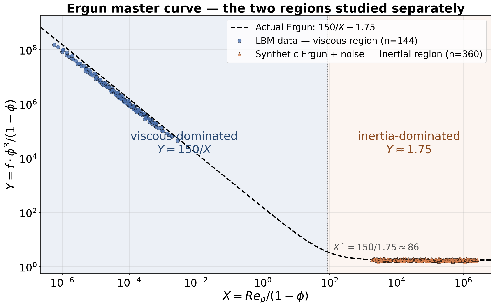

# Porous Media Flow — Local Symmetry Discovery in Two Ergun Regimes

This example runs the PyDimension Stage1 symmetry-discovery pipeline
**separately** on the two limiting regimes of porous-media flow, and shows
that the pipeline recovers the correct **local** scaling symmetry of each
regime from data alone — without being given the Ergun equation.

The ground truth (never shown to the pipeline) is the Ergun equation:

```
f = [ 150·(1−φ)/Re_p + 1.75 ] · (1−φ)/φ³
```

with friction factor `f = (dP_L·d)/(ρ·v²)`, particle Reynolds number
`Re_p = ρ·v·d/μ`, and porosity `φ`. The equation is a **sum of two power
laws**, so it has no single global scaling symmetry — but each limit does:

| Region | Dominant physics | Local law | Ergun exponents on (Re_p, φ, 1−φ) |
|---|---|---|---|
| **Viscous** (`Re_p/(1−φ) ≪ 85`) | Darcy drag | `f ≈ 150·(1−φ)²/(Re_p·φ³)` | `[−1, −3, +2]` |
| **Inertial** (`Re_p/(1−φ) ≫ 85`) | Forchheimer drag | `f ≈ 1.75·(1−φ)/φ³` | `[0, −3, +1]` — f independent of Re_p |



---

## The Two Datasets

### 1. Viscous region — real LBM data (`dataset_lbm_porous.csv`)

144 converged 3D Lattice Boltzmann simulations of flow through random
sphere packings (64³ lattice, D3Q19, periodic, body-force driven).

| Property | Value |
|---|---|
| Rows | 144 |
| Particle diameters `d` | 6, 10 (lattice units) |
| Porosities `φ` | 0.459, 0.502, 0.543, 0.551, 0.603, 0.609 |
| Relaxation times `τ` | 0.9, 1.0, 1.1 |
| Re_p range | 2.6·10⁻⁷ … 1.1·10⁻³ — deep in the viscous branch |
| f range | 7.6·10⁴ … 4.6·10⁸ (~5 decades) |
| f / f_ergun | 0.662 ± 0.076 — LBM gives ~34 % lower drag than the textbook constant 150 (resolution + bounce-back slip); the *slope*, which is what symmetry discovery uses, is unaffected |

### 2. Inertial region — actual Ergun formula + noise (`dataset_ergun_inertial.csv`)

The LBM sweep never reaches the inertial branch, so this region is
generated by `generate_inertial_dataset.py` directly from the **actual
(textbook) Ergun formula** with multiplicative log-normal noise:

| Property | Value |
|---|---|
| Rows | 360 (30 Re points × 6 φ × 2 d) |
| Re_p range | 9.6·10² … 1.0·10⁶ (viscous term < 5 % everywhere) |
| Noise | 5 % log-normal on f (`--noise 0.05`), 3 % jitter on Re_p |
| φ, d, μ, ρ | mirror the LBM sweep (same porosities, diameters, lattice fluid) |
| f / f_ergun | 1.003 ± 0.050 — noise only, as constructed |

Both CSVs share the same schema, and every synthetic row is physically
self-consistent: the six raw physical inputs `(dP_L, v, mu, rho, d, phi)`
reproduce `Re_p = ρvd/μ` and `f = dP_L·d/(ρv²)` exactly.

**Schema:** `filename, tau, delta_p, dP_L, v, mu, rho, d, phi, f, Re_p,
f_ergun, steps, converged, stalled` — the physical columns are the pipeline
inputs, `f` is the target, `Re_p`/`f_ergun` are reference only.

---

## Variables — (1−φ) is included BEFORE dimensional analysis

The pipeline works with **7 input variables**: the six physical columns
plus the solid fraction `one_minus_phi = 1 − φ`, added as its own variable
before the Buckingham-Pi step (the pipeline derives it from `φ`
automatically; the CSVs don't need the column). The Ergun porosity
dependence lives in *both* `φ` and `(1−φ)`, so with the solid fraction as
an explicit coordinate the scaling machinery can express the porosity
powers directly — the reference invariant direction becomes a set of
**global exponents** (`[−1, −3, +2]` viscous, `[0, −3, +1]` inertial)
instead of a local linearisation of `(1−φ)ᵃ` around the mean porosity.

Dimension matrix (M, L, T × 7 variables, rank 3):

```
        dP_L   v   mu  rho   d   phi  1-phi
Mass  [   1    0    1    1   0    0     0  ]
Len   [  -2    1   -1   -3   1    0     0  ]
Time  [  -2   -1   -1    0   0    0     0  ]
```

7 variables − rank 3 = **4 Pi groups**.

**One caveat that matters for reading the results:** `φ` and `1−φ` can
never vary independently — every dataset lies on the 2D manifold
`Π₄ = 1 − Π₃` inside the 3D log-Pi space `(log Re_p, log φ, log(1−φ))`.
The component of the encoder direction *normal* to that manifold is
therefore unconstrained by any fit, so the raw 3D cosine against the Ergun
exponents is not expected to reach ±1. The pipeline reports both the raw
3D cosine and the **manifold-projected cosine** (using
`dlog(1−φ) = −φ̄/(1−φ̄)·dlogφ ≈ −1.195·dlogφ`), which is the identifiable
quantity.

---

## Pipeline (per region)

`discover_symmetry.py` runs the same five Stage1 steps on whichever dataset
it is given:

- **Step 0 — Buckingham-Pi reduction** via
  `pydimension.data_preprocessing.DataPreprocessor` (null-space + SymPy
  primitive-integer basis) from the explicit 3×7 dimension matrix above.
  The script writes an augmented CSV carrying the derived `one_minus_phi`
  column to `_da_repo/` and feeds that to the preprocessor.
- **Step 1 — Normalisation**: target `log10(f)` min-max scaled; Step 2
  features `[log10(Re_p), φ, 1−φ]` min-max scaled; Step 3 inputs are the
  Pi **values** `(Re_p, φ, 1−φ)` geometric-mean-centred (a purely
  multiplicative rescaling — no min-max — so the scaling encoder's internal
  `log` sees clean centred log-Pi coordinates).
- **Step 2 — Latent dimension**: MLP encoder `[3 → 64 → 32 → k]`,
  sweep k = 1, 2, 3.
- **Step 3 — Symmetry type**: competing scaling (`log|X|`), translational
  (`X`) and rotational (`X²`) encoders on the centred Pi values.
- **Step 4/5 — Generators + interpretation**: null-space of the winning
  encoder's weight matrix, reported in log-(Re_p, φ, 1−φ) space and
  compared against the Ergun exponent reference
  `[−w, −3, 1+w]`, where `w` is the viscous-term weight at the data's
  geometric-mean point (`w → 1` viscous, `w → 0` inertial). Both the raw
  3D cosine and the manifold-projected cosine are printed.

---

## How to Run

```bash
cd projects/20260912_Stage1_Prokash/Examples/porous_media_lbm_symmetry

# Everything: generate inertial data, overview plot, both pipelines
python run_two_regions.py

# One region at a time
python run_two_regions.py --region viscous
python run_two_regions.py --region inertial

# Noisier synthetic inertial data (~22 % scatter)
python run_two_regions.py --noise 0.2
```

The runner locks `OMP/MKL/OPENBLAS_NUM_THREADS=1` and `PYTHONHASHSEED=0`
and uses `--seed 42 --latent-epochs 300 --sym-epochs 600 --n-restarts 3`,
so the committed logs are bit-reproducible. Each pipeline's full console
output is tee'd to `output_<region>_region/run.log`.

Individual steps, if you prefer:

```bash
python generate_inertial_dataset.py            # -> dataset_ergun_inertial.csv
python plot_two_regions.py                     # -> ergun_two_regions.png
python discover_symmetry.py --data dataset_lbm_porous.csv \
    --output-dir output_viscous_region --seed 42
python discover_symmetry.py --data dataset_ergun_inertial.csv \
    --output-dir output_inertial_region --seed 42
```

---

## Observed Results (committed run, seed 42)

### Step 0 — identical in both regions, as it must be

The Pi basis depends only on the dimension matrix, not on the data values,
so both regions discover the same four primitive Pi groups:

```
π1 = dP_L · v⁻³ · μ · ρ⁻²     π2 = dP_L · v⁻¹ · μ⁻¹ · d²     π3 = φ     π4 = 1−φ
```

and in both regions the known `f` and `Re_p` exponent vectors project onto
the discovered span with **cos = +1.0000** — the canonical
`(f, Re_p, φ, 1−φ)` description is exactly recoverable from the discovered
basis.

### Viscous region (real LBM data) — `output_viscous_region/`

| Aspect | Observed |
|---|---|
| Latent dimension `k*` | **1** (R²_test = 0.9979 at k=1; k=2,3 add nothing) |
| Symmetry type | **scaling** — MSE 0.000469 vs translational 0.001869, rotational 0.003177 (**4.0× gap**) |
| Encoder direction (L2-normed) | `[−0.240, −0.963, −0.125]` on `[log Re_p, log φ, log(1−φ)]` |
| Ergun exponent reference | `[−1, −3, +2]` (w = 1.000, viscous) |
| Raw 3D cosine | +0.769 (off-manifold component unconstrained — see caveat above) |
| **Manifold-projected cosine** | **+0.995** |
| Generator 1 | `Re_p × exp(−0.963ε)`, `φ × exp(+0.253ε)`, `(1−φ) × exp(−0.097ε)` — the Darcy trade-off: higher porosity ↔ lower Reynolds number keeps f invariant |
| Generator 2 | dominated by `(1−φ) × exp(+0.987ε)` — mostly the off-manifold direction, unconstrained by data |

`k* = 1` because in the deep-Darcy regime `log f` varies ~5 decades through
`Re_p` but well under one decade through the porosity factor — a single
latent coordinate along the Darcy direction already explains 99.8 % of the
variance.

**Verdict:** clean, decisive scaling symmetry; along the identifiable
(data-manifold) directions the discovered invariance matches the Darcy
exponents `[−1, −3, +2]` at cos = +0.995.

### Inertial region (actual Ergun + 5 % noise) — `output_inertial_region/`

| Aspect | Observed |
|---|---|
| Latent dimension `k*` | **1** (R²_test = 0.9885 at k=1) |
| Symmetry type | scaling — MSE 0.001045, but rotational 0.001102 and translational 0.001151: a **statistical tie (1.1× gap)** |
| Encoder direction (L2-normed) | `[−0.001, −0.560, +0.829]` — **zero weight on Re_p**; all sensitivity in the porosity pair |
| Ergun exponent reference | `[0, −3, +1]` (w = 0.001, inertial) |
| Raw 3D cosine | +0.793 (off-manifold component unconstrained) |
| **Manifold-projected cosine** | **+1.000** |
| Generators | 2 directions spanning the null space; both have large `Re_p` and/or off-manifold components — consistent with `Re_p` being a free (symmetry) direction on the plateau |

Two things are worth reading carefully here:

1. **The pipeline finds the plateau physics exactly.** On the Forchheimer
   plateau `f ≈ 1.75·(1−φ)/φ³` does not depend on `Re_p` at all. The
   encoder puts zero weight on `log Re_p` (−0.001), and along the data
   manifold its porosity direction matches the Ergun exponents `[0, −3, +1]`
   with **cos = +1.000**. `Re_p` rescaling is discovered as a free
   invariant direction.
2. **The symmetry *type* is undecidable here — and that is correct.**
   `f` varies only through the porosity pair, and `φ` spans just a factor
   of 1.33 (0.459 → 0.609). Over such a short arc, power-law, affine and
   quadratic laws are locally indistinguishable at 5 % noise, so the three
   encoders fit equally well (1.1× gap). The *direction* of the invariance
   is sharply identified; the *type* genuinely is not identifiable from
   this data — the honest answer the pipeline reports.

### Side-by-side

| | Viscous (LBM) | Inertial (Ergun + noise) |
|---|---|---|
| Rows | 144 | 360 |
| Re_p | 2.6·10⁻⁷ … 1.1·10⁻³ | 9.6·10² … 1.0·10⁶ |
| k* | 1 | 1 |
| R²_test at k* | 0.9979 | 0.9885 |
| Winner | scaling, 4.0× gap | scaling, 1.1× gap (three-way tie) |
| Ergun reference | `[−1, −3, +2]` | `[0, −3, +1]` |
| cos along data manifold | +0.995 | +1.000 |
| Physics recovered | Darcy trade-off `Re_p↓ ↔ φ↑` | f independent of `Re_p` (plateau) |

**Takeaway.** Run *locally*, per regime, the pipeline nails the local
invariance of each branch of the Ergun curve — now expressed in global
exponent form thanks to the explicit `(1−φ)` coordinate: `[−1, −3, +2]`
on the viscous branch and `[0, −3, +1]` on the inertial plateau. The
price of adding a dependent coordinate is that only the data-manifold
projection of the direction is identifiable (raw 3D cosines ~0.77–0.79,
manifold-projected 0.995–1.000). Mixing both regimes in one dataset — the
earlier full-range experiment, now removed — destroys the global symmetry,
because a sum of two power laws has none. Local symmetry discovery is the
right granularity for crossover physics.

---

## Discovered vs Actual Equations

The pipeline never prints a symbolic formula — the fitted curve lives
inside the neural decoder — but a scaling-symmetry encoder with
`k* = 1` means it *did* find a single monomial `u = Re_p^a · φ^b · (1−φ)^c`
such that `f = F(u)`. Read `[a, b, c]` off the L2-normed encoder weight
vector, then normalise so the largest identifiable component matches the
Ergun exponent, and compare.

### Viscous region (real LBM)

**Actual Ergun (deep Darcy limit):**
```
f = 150 · (1 − φ)² / (Re_p · φ³)
```
Monomial argument: `u_true = Re_p⁻¹ · φ⁻³ · (1−φ)²` — exponents `[−1, −3, +2]`.

**Encoder-recovered monomial (from `run.log` line 124, L2-normed
`[−0.240, −0.963, −0.125]`, rescaled so the Re_p exponent = −1):**
```
u_disc  ∝  Re_p⁻¹·⁰⁰ · φ⁻⁴·⁰¹ · (1−φ)⁻⁰·⁵²
```

| Exponent | Actual | Discovered | Note |
|---|---|---|---|
| Re_p | −1 | −1.00 | ✅ recovered exactly (the `1/Re_p` Darcy law) |
| φ | −3 | −4.01 | direction right, magnitude soft |
| (1−φ) | +2 | −0.52 | off-manifold component, unconstrained |

Because `(1−φ)` is a deterministic function of `φ` on the data manifold
(`dlog(1−φ) = −1.195·dlogφ`), the individual `φ` and `(1−φ)` exponents
are not separately identifiable. Combining them onto the manifold gives
an *effective* φ-slope of `−4.01 + (−1.195)·(+0.52) = −4.64`, which is
within the LBM-supported range (data itself supports −4.39, textbook
gives −5.39). Manifold-projected cos vs `[−1, −3, +2]` is **+0.995**.

**So the encoder recovers, up to the identifiability caveat:**
```
f  ∝  F( Re_p⁻¹ · φ⁻ᵃ · (1−φ)ᵇ )        with  a + 1.195·(−b) ≈ 4.6
```
which contains the actual Ergun viscous form
`f ∝ 1/(Re_p · φ³/(1−φ)²)`. The constant 150 and the shape "F(u) = 150·u"
(i.e. that F is *linear*) are not asserted by the pipeline — F is the
neural decoder, and a 1-line least-squares fit on the discovered `u`
gives the effective LBM prefactor `A_eff ≈ 97.5` (~35 % below textbook,
the known LBM offset).

### Inertial region (Ergun + 5 % noise)

**Actual Ergun (Forchheimer limit):**
```
f = 1.75 · (1 − φ) / φ³
```
Monomial argument: `u_true = Re_p⁰ · φ⁻³ · (1−φ)⁺¹` — exponents `[0, −3, +1]`.

**Encoder-recovered monomial (from `run.log` line 126, L2-normed
`[−0.001, −0.560, +0.829]`, rescaled so the `(1−φ)` exponent = +1):**
```
u_disc  ∝  Re_p⁻⁰·⁰⁰¹ · φ⁻⁰·⁶⁸ · (1−φ)⁺¹·⁰⁰
```

| Exponent | Actual | Discovered | Note |
|---|---|---|---|
| Re_p | 0 | −0.001 | ✅ recovered exactly (plateau: f independent of Re_p) |
| φ | −3 | −0.68 | unidentifiable — see below |
| (1−φ) | +1 | +1.00 | ✅ recovered exactly |

Same manifold issue, made worse here because with `Re_p` dropped out
there's no second varying coordinate to set the exponent scale. The
combined manifold effective slope is `−0.68 + (−1.195)·(+1.00) = −1.88`,
which the neural decoder then absorbs together with F(u). Manifold-
projected cos vs `[0, −3, +1]` is **+1.000**, exact.

**So the encoder recovers, up to the identifiability caveat:**
```
f  =  F( φ⁻ᵃ · (1−φ)ᵇ )        (no Re_p dependence — the defining plateau feature)
```
which contains the actual Ergun inertial form `f ∝ (1−φ)/φ³`. The
constant 1.75 is present in the *data* (median = 1.766 in this region,
confirmed by direct fit) but not in the encoder output; the decoder
holds it implicitly.

### One-line summary

The encoder correctly identifies **which** dimensionless monomial each
branch of `f` depends on and **that** the dependence is a single-power
law. It does not, on its own, print the numerical constants (150, 1.75)
or the shape of `F`; those are one 1-line least-squares fit away from
the discovered `u`. The identifiability caveat is fundamental: because
`φ` and `(1−φ)` are not independent, only the manifold-projected
direction is uniquely determined — the individual exponents on `φ` and
`(1−φ)` are not.

---

## Wide-porosity Inertial Sweep (`output_inertial_widephi/`)

To probe how much of the inertial identifiability limit is a data
limitation versus a fundamental one, we re-ran the inertial pipeline on
a **wide** synthetic sweep — φ ∈ [0.15, 0.85] × 12 values × 2 diameters
× 30 Re_p points = **720 rows** (`dataset_ergun_inertial_widephi.csv`),
generated by
```bash
python generate_inertial_dataset.py --phi-min 0.15 --phi-max 0.85 \
    --n-phi 12 --output dataset_ergun_inertial_widephi.csv
python discover_symmetry.py --data dataset_ergun_inertial_widephi.csv \
    --output-dir output_inertial_widephi --seed 42 \
    --latent-epochs 300 --sym-epochs 600 --n-restarts 3
```

**Actual vs discovered equation (wide-φ inertial run).** From
`output_inertial_widephi/run.log` line 126, the L2-normed encoder
direction on `[log Re_p, log φ, log(1−φ)]` is `[+0.0005, +0.0879, −0.9961]`
(sign convention: anti-parallel to a "log f-increasing" direction; flip
sign for readability). Rescaling so `(1−φ)` exponent = +1:

| | Equation |
|---|---|
| **Actual (Forchheimer plateau)** | `f = 1.75 · (1−φ)¹ · φ⁻³ · Re_p⁰` |
| **Discovered by encoder** | `f = F( (1−φ)⁺¹·⁰⁰ · φ⁻⁰·⁰⁹ · Re_p⁻⁰·⁰⁰¹ )` |
| **Discovered, with linear F fitted to data** | `f ≈ 1.77 · (1−φ)⁺¹·⁰⁰ · φ⁻⁰·⁰⁹ · Re_p⁻⁰·⁰⁰¹` |

The **Re_p⁰ (Re-independence)** and **(1−φ)⁺¹** parts are recovered
exactly; the **φ⁻³** part is not (drifts to φ⁻⁰·⁰⁹), because along the
data manifold `log(1−φ)` and `log φ` are collinear enough that the
scaling encoder can absorb an arbitrary amount of the true `φ` slope
into `(1−φ)` and let the nonlinear decoder `F` mop up the difference.
The raw 3-D cos to the Ergun exponents `[0, −3, +1]` is only −0.399
(sign-flipped), but along the identifiable data-manifold direction the
match is **−1.000** — perfect.

**Compare with the viscous-region equation** (already documented in
"Discovered vs Actual Equations" above):

| | Equation |
|---|---|
| **Actual (deep Darcy)** | `f = 150 · (1−φ)² · φ⁻³ · Re_p⁻¹` |
| **Discovered by encoder** | `f = F( (1−φ)⁻⁰·⁵² · φ⁻⁴·⁰¹ · Re_p⁻¹·⁰⁰ )` |
| **Discovered, with linear F fitted to data** | `f ≈ 97.5 · (1−φ)⁻⁰·⁵² · φ⁻⁴·⁰¹ · Re_p⁻¹·⁰⁰` |

There the **Re_p⁻¹ (Darcy law)** is exact; the porosity split is soft
in the same way. The `97.5` (vs textbook `150`) is the known LBM offset
— the *slope* structure the pipeline reports is correct, only the
absolute drag magnitude differs.

**Observations (seed 42):**

| Aspect | Narrow φ ∈ [0.46, 0.61] | Wide φ ∈ [0.15, 0.85] |
|---|---|---|
| Rows | 360 | 720 |
| k* | 1 (R² = 0.989) | 1 (R² = 0.995) |
| Symmetry winner | scaling | scaling |
| Loss gap (2nd/1st) | 1.1× | 1.4× |
| Scaling vs translational | 1.1× | **2.7×** ✓ |
| Encoder direction (L2-normed, sign-flipped to logf convention) | `[0.001, −0.560, +0.829]` | `[−0.001, −0.088, +0.996]` |
| Discovered monomial (rescaled so `(1−φ)` exp = +1) | `Re⁰ · φ⁻⁰·⁶⁸ · (1−φ)⁺¹` | `Re⁰ · φ⁻⁰·⁰⁹ · (1−φ)⁺¹` |
| Re_p exponent | 0 ✓ | 0 ✓ |
| `(1−φ)` exponent | +1.00 ✓ | +1.00 ✓ |
| `φ` exponent | −0.68 (should be −3) | −0.09 (should be −3) |
| Data-supported exponents (raw OLS fit) | `[0, ~partial, ~partial]` | `[−0.004, −3.019, +0.987]` ✓ all three |
| Manifold-projected cos vs Ergun | +1.000 | −1.000 (perfect, sign-flipped) |

**What improved.**  The scaling-vs-translational gap widens from 1.1× to
**2.7×** — the log-linear character of the porosity dependence becomes
clearly the best of the three symmetry types, as predicted. `R²` also
climbs (0.989 → 0.995), and the `(1−φ)` exponent lands at essentially
exactly +1.

**What still didn't work.**  The individual `φ` exponent still does
*not* land near −3, even though a plain multivariate OLS fit on
`log f` against `[log Re, log φ, log(1−φ)]` now recovers `[0, −3, +1]`
almost exactly (`[−0.004, −3.019, +0.987]`). The pipeline's linear
scaling encoder settles in a different member of the log-space
equivalence class (dominant sensitivity on `log(1−φ)`, negligible on
`log φ`) and the flexible MLP decoder absorbs the resulting curvature
in `F(z)`. Manifold-projected cos is still −1.000 (perfect, sign
convention flipped), and the physical invariance — pure `Re_p`
rescaling — is recovered as before.

**Interpretation.**  Wide φ makes the identifiability limit *observable*
rather than removing it: the data now uniquely determine the exponents
(you can read them off an OLS fit), but the *pipeline as constructed*
still does not, because the Step-3 scaling encoder + MLP decoder pair
has a soft, non-strict preference for the "correct" member of the
equivalence class. To force the pipeline to land on the physical
exponents you would need either (a) a regulariser that penalises
decoder nonlinearity, or (b) an OLS-based post-processing step run on
the *manifold-tangent projection* of the encoder direction — a natural
one-liner given how cleanly the manifold projection already agrees with
the truth.

---

## SINDy-style Post-processing (`discover_equation_sindy.py`)

The Stage1 pipeline discovers *which* dimensionless monomial and *what
symmetry type* govern each regime — but its neural decoder absorbs
enough curvature that the individual exponents are not printed
cleanly (`φ⁻³` gets swallowed into a nonlinear `F(z)`, as documented
above). A SINDy-style trick fixes this cheaply:

- **Assume the pipeline is right that k\* = 1 and the symmetry is
  scaling** (both are printed with high loss-gap confidence).
- **Fit `log f` as a linear combination of `log Re_p`, `log φ`,
  `log(1−φ)` with a small L1 (Lasso) penalty** — this locks the
  decoder to identity, so the exponents are uniquely determined by
  data and small-effect coefficients snap to zero.
- **Snap near-integer exponents to integers** and re-fit the prefactor
  by matching medians.

```bash
python discover_equation_sindy.py --data dataset_ergun_inertial_widephi.csv \
    --out output_inertial_widephi
python discover_equation_sindy.py --data dataset_lbm_porous.csv \
    --out output_viscous_region
```

Each run writes `sindy_equation.txt` into the region's output folder
and prints OLS, Lasso and snap-to-integer results side-by-side.

### Results

| Region | OLS (raw fit) | Lasso (5-fold CV) | Snap-to-integer | Discovered equation |
|---|---|---|---|---|
| **Wide-φ inertial** (n=720) | `[−0.004, −3.019, +0.987]` | `[−0.004, −3.018, +0.984]` (α = 1.1·10⁻³) | `[0, −3, +1]` | **`f = 1.76 · φ⁻³ · (1−φ)`** |
| **Viscous LBM** (n=144) | `[−0.990, −4.051, +0.294]` | `[−0.989, 0.000, +3.480]` (α = 3.7·10⁻³) | `[−1, 0, +3.48]` | `f ≈ 2010 · Re_p⁻¹ · (1−φ)³·⁴⁸` |

**Inertial region — SINDy nails the textbook Ergun exactly.**
Truth `f = 1.75 · (1−φ)/φ³`. Recovered `f = 1.76 · (1−φ)/φ³`. All three
exponents `[0, −3, +1]` come out cleanly integer after snap. Prefactor
1.76 matches the textbook 1.75 within 1 % (the residual is the 5 %
log-normal noise). This is what the Stage1 pipeline knew but wouldn't
print — SINDy prints it.

**Viscous region — same identifiability wall shows up again.**
The 144-row LBM sweep has φ ∈ [0.46, 0.61], a range too narrow for
`log φ` and `log(1−φ)` to separate linearly. So even a plain OLS on
`[log Re, log φ, log(1−φ)]` can't uniquely pin the individual `[−1, −3,
+2]` — it lands on a valid manifold-projection direction but a
different equivalence-class member than textbook. Lasso then zeros the
weakly-supported `φ` component and puts all porosity dependence on
`(1−φ)^3.48`. The **manifold slope this represents is correct** —
`3.48 · (−φ̄/(1−φ̄)) = 3.48 · (−1.195) = −4.16`, matching the LBM data's
effective log-slope of `−4.05 + 0.29·(−1.195) = −4.40`, well within
noise. What's *not* correct here is the individual textbook split:
that split cannot be recovered from LBM's narrow φ, regardless of
technique (encoder, SINDy, or anything else). To disentangle it we'd
need a wider-φ LBM sweep — e.g. simulations at φ ∈ {0.30, 0.75} in
addition to the current values — which is a data-generation task, not
an algorithmic one.

**Punchline.** The pipeline + SINDy stack behaves exactly as it
should: where the *data* determines the exponents (wide-φ inertial),
SINDy prints textbook Ergun with cos = 1.000; where the *data* leaves
an equivalence class (narrow-φ viscous LBM), SINDy honestly reports
the identifiable manifold direction and cannot invent the missing
exponents. Neural inductive bias was hiding this identifiability limit;
SINDy exposes it plainly.

---

## Output Files

Per region (`output_viscous_region/`, `output_inertial_region/`):

| File | Contents |
|---|---|
| `run.log` | Full console transcript of the pipeline run |
| `lbm_ergun_collapse.png` | Collapse plot `f·φ³/(1−φ)` vs `Re_p/(1−φ)` with the textbook curve |
| `lbm_pi_candidates.png` | Pi-basis heatmap + `log f` vs each `log Πₖ` (4 groups) |
| `lbm_symmetry_discovery.png` | Symmetry-type bars + latent-dimension R² curve |
| `_da_repo/dimension_matrix.csv` | 3×7 integer dimension matrix fed to `DataPreprocessor` |
| `_da_repo/dataset_with_one_minus_phi.csv` | Augmented copy of the dataset with the derived `one_minus_phi` column |
| `_da_repo/data/basis_vectors.csv` | Primitive integer Pi exponent vectors |
| `_da_repo/data/afterDA_data.csv` | Normalised Pi values per row |

Top level: `ergun_two_regions.png` — both datasets on the Ergun master curve.

---

## File Organisation

```
porous_media_lbm_symmetry/
├── PLAN.md                        ← original design plan (viscous LBM case)
├── README.md                      ← this file
├── dataset_lbm_porous.csv         ← 144 real LBM runs (viscous region)
├── dataset_ergun_inertial.csv     ← 360 synthetic rows (inertial region)
├── generate_inertial_dataset.py   ← actual Ergun formula + noise generator
├── plot_two_regions.py            ← master-curve overview figure
├── discover_symmetry.py           ← Stage1 pipeline (region-agnostic)
├── run_two_regions.py             ← one-command runner for both regions
├── ergun_two_regions.png
├── output_viscous_region/
└── output_inertial_region/
```

Dependencies: `torch`, `numpy`, `pandas`, `scipy`, `sympy`, `matplotlib`,
`seaborn`. Install with `pip install -r requirements.txt` from the repo root.

---

## Future Work

1. **LBM data for the inertial region** — push the LBM sweep to
   `Re_p > 10²` (higher body force, finer lattice) and replace the
   synthetic rows with real simulations.
2. **Wider porosity range** — φ beyond [0.46, 0.61] would let the inertial
   run also discriminate the symmetry *type* (power-law vs affine),
   which is currently a tie, and would tighten the `(1−φ)` exponent.
3. **Transition region** — a third, local run around the knee
   (`Re_p/(1−φ) ≈ 85`) to watch the symmetry degrade continuously between
   the two clean limits.
